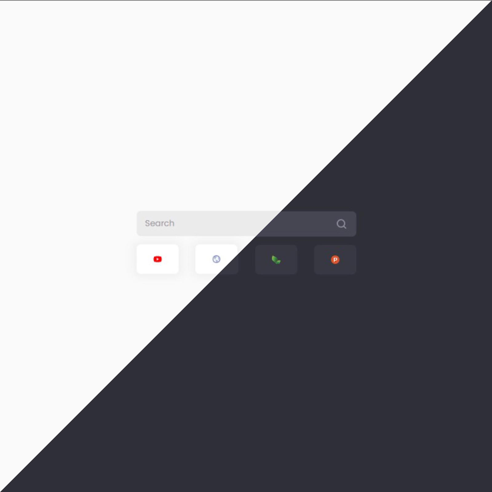

<h1 align="center"> Flowtab </h1>
<h3 align="center"> A beautiful and elegant new tab for your browser. </h3>
<h3 align="center">Created by <a href="https://github.com/SameeraMurthy/">@SameeraMurthy</a> and <a href="https://github.com/rakshitranga">@RakshitRanga</a></h3>

 

See the time and date, top sites, and use light theme or dark theme to greet you when you open your browser.

## To Do List
[] Settings in Popup
[] Wallpaper Support